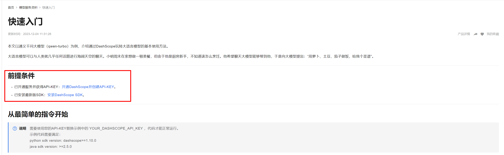
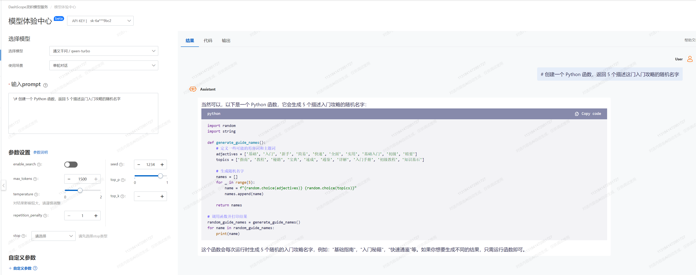
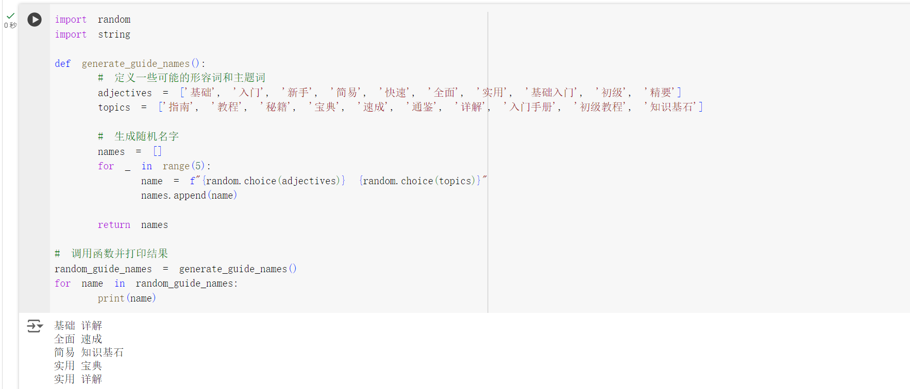

# 1. AI的最新进展与科研应用

> 导读: 该部分介绍AI的最新进展以及在科研各个领域的应用
目前AI发展到什么程度了？哪些问题可以尝试用AI解决呢？如何快速构建一个属于自己的AI应用程序？
## 本教程目标：
1. 与语言模型交互，使用零样本和少样本学习来测试其能力。
2. 学习使用 通义千文 的文本完成功能构建简单的应用程序，并使用其代码生成功能。
## 本教程内容：
### 0. 工具准备说明

1.Python 程序运行工具：[Kaggle Notebook](./1.prepare_python.md), [Google Colab]((./1.prepare_python.md))

### 1. 获得大模型调用权限

通义千问：https://help.aliyun.com/zh/dashscope/developer-reference/quick-start

分别完成下面这两步

<center>
<div style="width: 100%;">    </div>
<center>

### 2. 文本生成

让我们使用语言模型生成文本。语言模型是单词序列上的概率分布。语言模型可以简单地进行训练来预测句子中的下一个单词。语言模型擅长理解和生成文本。我们可以制定许多任务，包括摘要、问答、提取数据、翻译，并将完成其中的一些任务。我们将研究语言模型完成文本的能力，具体而言我们将为模型提供一些文本输入，然后让模型为我们返回完整的文本。https://dashscope.console.aliyun.com/playground

<center>
<div style="width: 100%;">    </div>
<center>

### 3. 代码编辑

\# 创建一个 Python 函数，返回 5 个描述这门入门攻略的随机名字

<center>
<div style="width: 100%;">    </div>
<center>

```python
import random
import string

def generate_guide_names():
    # 定义一些可能的形容词和主题词
    adjectives = ['基础', '入门', '新手', '简易', '快速', '全面', '实用', '基础入门', '初级', '精要']
    topics = ['指南', '教程', '秘籍', '宝典', '速成', '通鉴', '详解', '入门手册', '初级教程', '知识基石']

    # 生成随机名字
    names = []
    for _ in range(5):
        name = f"{random.choice(adjectives)} {random.choice(topics)}"
        names.append(name)

    return names

# 调用函数并打印结果
random_guide_names = generate_guide_names()
for name in random_guide_names:
    print(name)
```

让我们将其移到 Notebook 中，看看它是否真的可以执行。

<center>
<div style="width: 100%;">    </div>
<center>
