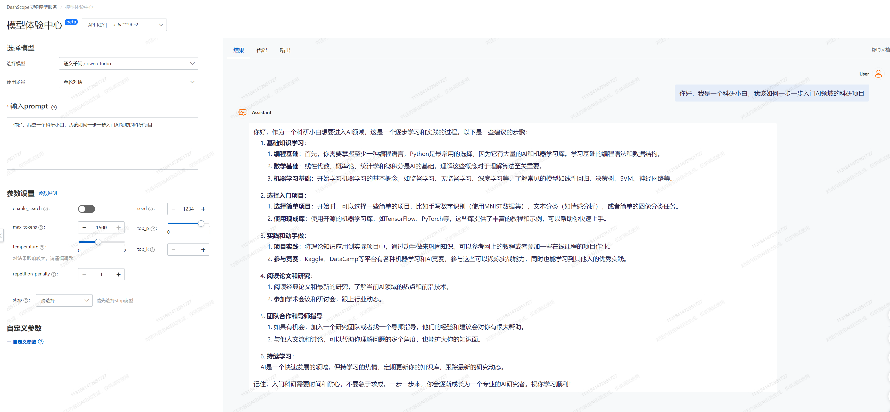

# AI的最新进展与科研应用

> 导读: 该部分介绍AI的最新进展以及在科研各个领域的应用
目前AI发展到什么程度了？哪些问题可以尝试用AI解决呢？如何快速构建一个属于自己的AI应用程序？
## 本教程目标：
1. 与语言模型交互，使用零样本和少样本学习来测试其能力。
2. 学习使用 GPT-3 的文本完成功能构建简单的应用程序，并使用 Codex 的代码生成功能。
## 本教程内容：
### 1. 文本生成

让我们使用语言模型生成文本。语言模型是单词序列上的概率分布。语言模型（例如GPT-3）可以简单地进行训练来预测句子中的下一个单词。语言模型擅长理解和生成文本。我们可以制定许多任务，包括摘要、问答、提取数据、翻译，并将完成其中的一些任务。我们将研究语言模型完成文本的能力，具体而言我们将为模型提供一些文本输入，然后让模型为我们返回完整的文本。

    

### 2. 代码编辑

