# 2. 如何掌握Python工程流程

> 导读: 本次课程让你了解 Python 工程工作流程（这是许多人工智能项目的核心）是什么样子。五年前的大二期间，我第一次接触的编程语言的C语言，我当时最害怕的就是上机实验，最害怕的就是点击程序运行按钮，因为我不清楚之后会发生什么，更害怕出现一片红色警报。因此，在我们讲解机器学习工作流程的复杂性之前，我想带你了解一些可供你使用的强大编程工具，让你对编程不再感到畏惧。本次课程以实时代码的形式进行，以应对编程的挑战。熟悉编程工作流程需要大量的时间和练习，因此，虽然在本课程结束时你不会神奇地变得更好（你甚至可能比短期内开始时慢），但你将拥有一个宏观的视角，看到高效的工作流程。
## 本教程目标：
1. 使用本地Python 编辑器 (**VSCode/Pycharm**) 编辑 Python 代码
2. 在代码工作流程中轻松使用 **代码版本管理工具Git** 和 **环境管理工具 conda/venv**。
3. 遇到错误怎么办：如何使用**断点，日志点，Print**进行调试，解决问题
## 本教程内容：
### 0. 工具准备说明

1.安装VScode https://zhuanlan.zhihu.com/p/264785441

2.安装Git https://blog.csdn.net/mukes/article/details/115693833

3.安装Conda https://blog.csdn.net/Q_fairy/article/details/129158178

4.下载库

### 1. VScode使用

好的，接下来，在 VSCode 上打开一个新项目。

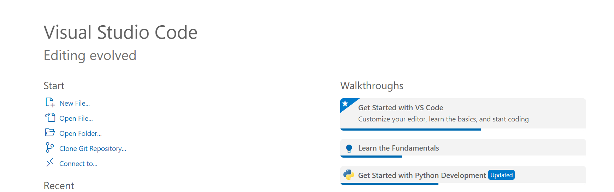


我们将使用选项"Clone Git Repository"，克隆 git 存储库。输入https://gitee.com/wenglean/python-practice.git

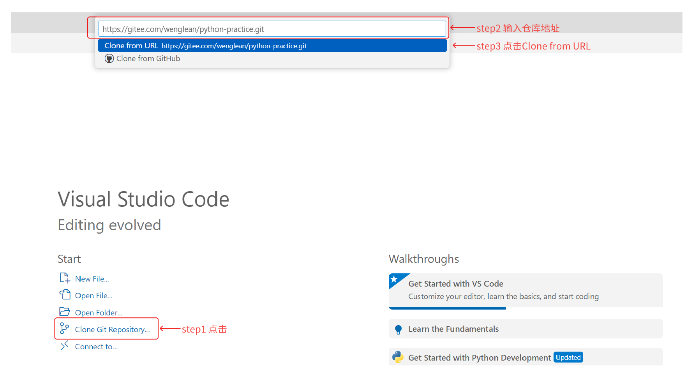

选择某个文件夹地址进行保存，并点击Open.

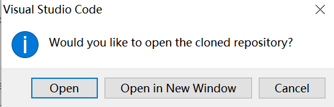

就能看到以下代码。

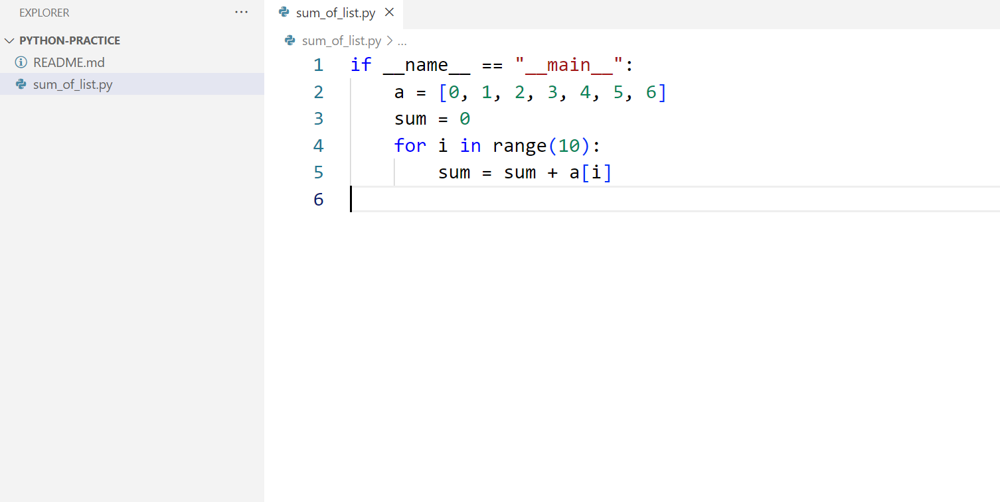

点击运行代码

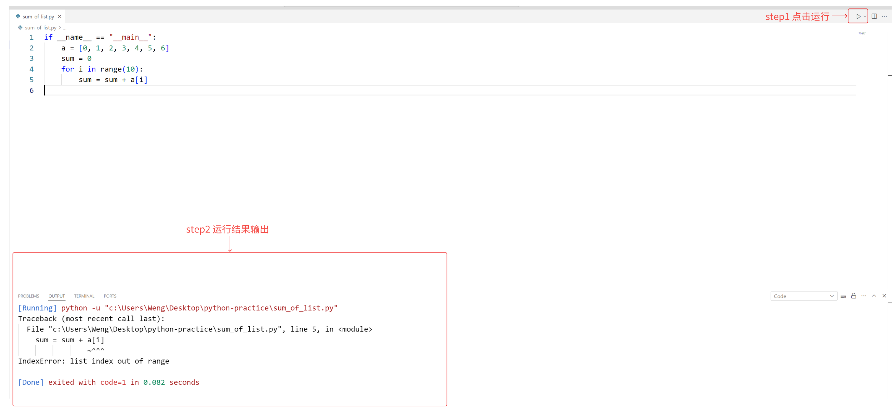

**总结：**

至此，你目前完成了一件什么样的事？

1.你在本地下载了一个代码编辑器，这是一个管理和编写代码的工具。2.你通过Git工具从互联网上下载了一份开源的代码，这是别人撰写好的。(当然以后你写的代码也可以上传到gitee/github平台，和大家共享或者共同完成)，至于具体的git/github细节我们先不用去深究，随着经常用自然会逐渐深入 3. 点击运行按钮，执行这段代码，并查看了结果。非常好，你已经迈出了第一步。

啊，但是好像情况又没有那么好，细心的你可能会发现，这个代码好像并没有执行成功，因为至少看到了一些红色的警告。没关系，代码出错很正常。我们继续往下看。

### 2. 调试(Debug)

#### step1: 读懂代码

请你确保完成了之前的步骤，并且成功地运行了从远程下载下来的代码，并且发现这个代码产生了错误，也就是所谓的bug。接下来，我们一步一步来解决这个问题。第一件事是先~~深呼吸~~，研究一下代码，我们至少得先看看这个代码实现了什么功能。

```python
if __name__ == "__main__":
    a = [0, 1, 2, 3, 4, 5, 6]
    sum = 0
    for i in range(10):
        sum = sum + a[i]
```

我们逐行地来解释这段代码：

`if __name__ == "__main__":`  这是一个判断语句，可以理解为是运行这个sum_of_list.py文件的程序入口，即接下来计算机会去执行下面的语句。

`a = [0, 1, 2, 3, 4, 5, 6]` —— 这行创建了一个列表（list）`a`，其中包含了从0到6的整数。

`sum = 0` —— 初始化一个变量`sum`，其值为0，这个变量将用于累加列表`a`中的元素。

`for i in range(10):` —— 开始一个循环，迭代从0到9的整数（共10次迭代），因为`range(10)`生成的是一个包含0到9的整数序列。

`sum = sum + a[i]` —— 在每次循环中，这个语句尝试将列表`a`中索引为`i`的元素加到`sum`变量上。

好在现在有大模型，我们大多时候求助于他就好了。

打开[通义 (aliyun.com)](https://tongyi.aliyun.com/qianwen/) ， 复制上面的代码块，到聊天框，并加一些指令，比如"逐行解释这段代码"，结果如下图所示。

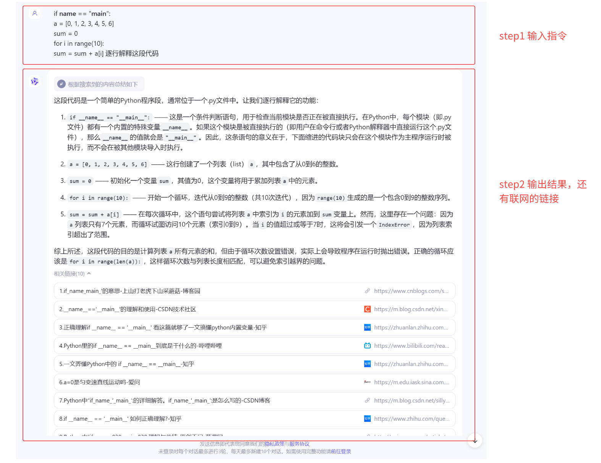

我们根据他的回答，可以知道这是一段要计算一个列表元素和的代码。

#### step2 读懂报错结果

```python
[Running] python -u "c:\Users\Weng\Desktop\python-practice\sum_of_list.py"
Traceback (most recent call last):
  File "c:\Users\Weng\Desktop\python-practice\sum_of_list.py", line 5, in <module>
    sum = sum + a[i]
                ~^^^
IndexError: list index out of range

[Done] exited with code=1 in 0.082 seconds
```

同样的，接下来你自己再尝试一下用大模型聊天来了解这结果的含义

- `[Running] python -u "c:\Users\Weng\Desktop\python-practice\sum_of_list.py"` 表示你的代码正在由Python解释器执行。`-u` 参数表示以 unbuffered 模式运行 Python，使得输出能够即时显示。紧跟其后的是脚本的完整路径。所以其实点击运行，等价于执行了这条语句。
- `Traceback (most recent call last):` 这是Python在遇到错误时的回溯跟踪开始，显示了错误发生前的函数调用序列。这里显示的是最近一次调用，即错误发生的直接上下文。一般有错误的结果都会有这条语句
- `File "c:\Users\Weng\Desktop\python-practice\sum_of_list.py", line 5, in <module>` 指出了错误发生的文件名、具体行号（line 5）以及错误发生在模块的顶层代码中（`<module>`表示文件的直接执行部分，非函数内）。
- `sum = sum + a[i]` 显示了导致错误的那行代码。波浪线`~^^^`标记了错误发生的具体位置，这里指向了列表索引`a[i]`，表明问题出在尝试访问列表的一个索引。
- `IndexError: list index out of range` 是错误的具体类型和描述。它说明程序尝试访问的列表索引超出了列表的有效范围。在Python中，列表的合法索引是从0到`len(list) - 1`，任何超过这个范围的索引访问都会引发`IndexError`。
- `[Done] exited with code=1 in 0.082 seconds` 表明程序已经运行结束，并且是以错误状态退出（exit code 1通常表示有错误发生），整个执行过程耗时0.082秒。

所以根据报错的提示，我们定位了具体出错的代码行数，是在第5行，也就是说，代码按照逻辑执行，执行到这一行的时候，发生了错误。错误是`IndexError: list index out of range` 。需要注意的是，这一行出现错误，并不意味着我们就仅仅需要在这一行代码上修改就好了，因为错误的本质原因可能是在之前的代码就埋下了，只不过在这一行，错误掩盖不住了。

#### step3 断点调试

为了了解具体都发生了什么，我们可以借助断点工具来实现。官方的教程在这里[Debugging in Visual Studio Code](https://code.visualstudio.com/docs/editor/debugging#_breakpoints)

首先添加断点

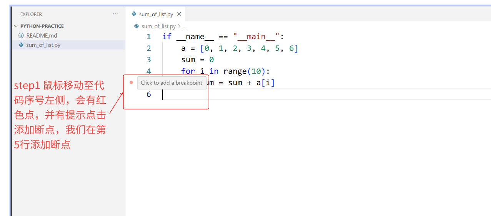

接下来，选择debug模式启动代码，步骤如下。

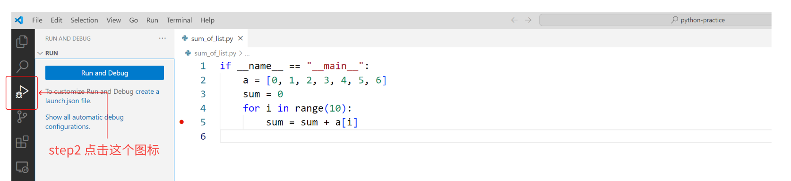

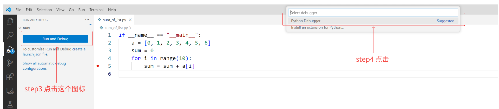

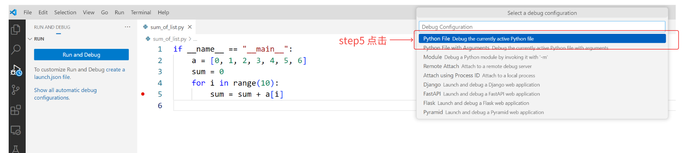

选择一个python.exe，便成功启动debug模式。

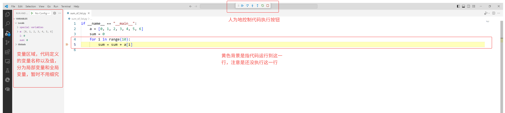

我们注意主要关注这三个区域。首先是变量区域，其实是代码中黄色区域的提示，最后是上方的控制代码执行按钮。到目前为止，我们已经做了什么？可以参考下面这张图，能更好的理解我们做了什么。假设目前代码是由多个代码块组成，并且正常执行，即简单的顺序从左到右执行，直接输出最终结果。那么我们在这里的操作是断点执行，我们添加了一个断点，并且启动，代码就执行到我们的断点位置，就停止不动了。我们能通过左侧的变量区域查看中间的结果，比如，a变量存储了一个list：[0, 1, 2, 3, 4, 5, 6]，i此刻为0，sum此刻为0

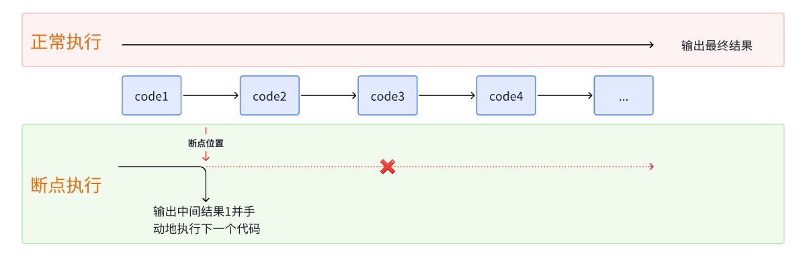

接下来就是需要通过上方点击特定按钮，人为地控制代码执行。有多种不同的选择。鼠标放上去会有提示，具体功能如下表。


| 继续 / 暂停 Continue F5    | 继续：恢复程序/脚本的正常执行（直到下一个断点）。 暂停：检查当前行的代码并逐行调试。 |
| -------------------------- | ------------------------------------------------------------ |
| 步过 Step over F10         | 将下一个方法作为单一命令执行，不检查或跟踪其组件步骤。       |
| 步入 Step Into F11         | 进入下一个方法，逐行跟踪其执行。                             |
| 步出 Step Out Shift+F11    | 在方法或子程序内部时，返回到之前的执行上下文，通过将当前方法的剩余行完成为一个单一命令。 |
| 重启 Restart Ctrl+Shift+F5 | 终止当前程序执行，并使用当前运行配置重新开始调试。           |
| 停止 Shift+F5              | 终止当前程序执行。                                           |

1. **调试过程**：

   当程序运行到 `for` 循环的 `sum = sum + a[i]` 这一行时，它会暂停。

   - **继续 / 暂停 (F5)**：
     - **继续**：按 F5，程序会继续执行，直到再次遇到断点或程序结束。在这个例子中，程序会在每次迭代中重新暂停在 `sum = sum + a[i]` 这一行。
     - **暂停**：如果程序正在运行并且你想暂停执行，可以按 F5 进行暂停。
   - **步过 (F10)**：
     - 按 F10，程序会执行当前的 `sum = sum + a[i]` 语句，然后移动到下一行。这时，`i` 会增加，`sum` 会更新。每次按 F10，程序都会在 `for` 循环中执行下一次迭代的 `sum = sum + a[i]` 语句，而不会进入其他函数。
   - **步入 (F11)**：
     - 在这个例子中，按 F11 与 F10 的效果相同，因为没有其他函数调用。如果有函数调用，比如 `sum = add(sum, a[i])`，按 F11 会进入 `add` 函数。
   - **步出 (Shift+F11)**：
     - 在这个例子中，步出没有太大作用，因为我们没有嵌套的方法调用。但是，如果我们在一个函数内部，按 Shift+F11 会执行完当前函数的剩余部分，并返回到调用函数。
   - **重启 (Ctrl+Shift+F5)**：
     - 按 Ctrl+Shift+F5，会终止当前程序执行，并重新开始调试。程序会从头开始运行，并在 `sum = sum + a[i]` 断点处暂停。
   - **停止 (Shift+F5)**：
     - 按 Shift+F5，终止当前程序执行。如果你完成了调试或想停止调试，按这个键。

   具体跟着步骤来调试吧。

   1. 按 F10，可以看到，程序执行了第5五行，并且继续执行，由于是一个循环，并且循环还没结束，代码回到了第四行，准备执行第四行。我们此刻观察左边变量值，发现，sum还是0，原因在图中解释了。

   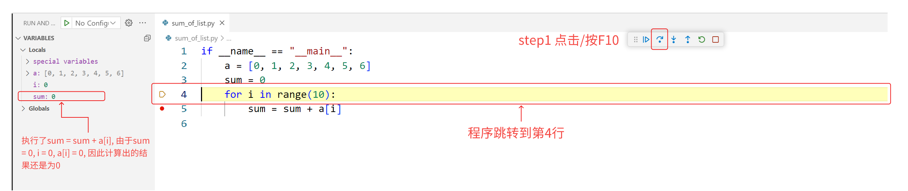
   2. 继续按F10，结果如下，此刻i = 1, sum = 0。记住目前这个变量值，下一步就用到了。

   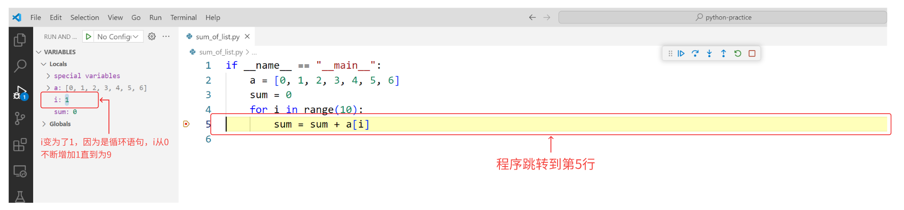

   3.继续按F10，我们会发现如下的结果。sum 的值更新了，为1。为什么？因为代码执行了第5行，并且此刻停在了第4行。执行的第5行代码是，sum = sum + a[i]。关注等号右边的计算过程，根据第2步可以，可以发现i = 1， sum=0。所以此刻a[1] = 1（注意下标是从0开始的，即a[0]代表第一个元素0），因此sum +a[1] = 1，代码并将右边计算出的结果1，赋值给左边sum，因此发生了更新。

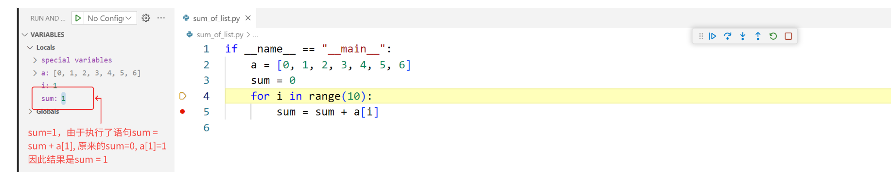

看样子第5行也没有问题，能正常执行，但是为什么还是会报错呢？别着急，请继续点击F10让其继续执行。中间步骤我就不写了，直到运行到如下变量值。i = 7, 此时，sum=21，并且代码即将执行第五行。

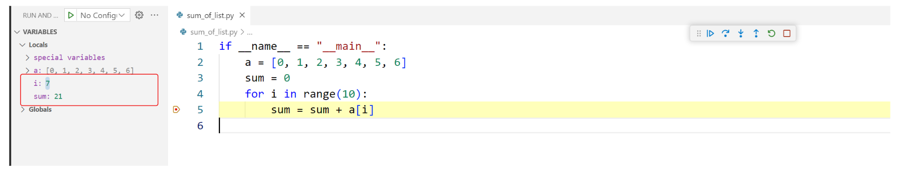

我们继续点击F10，看看会发生什么？

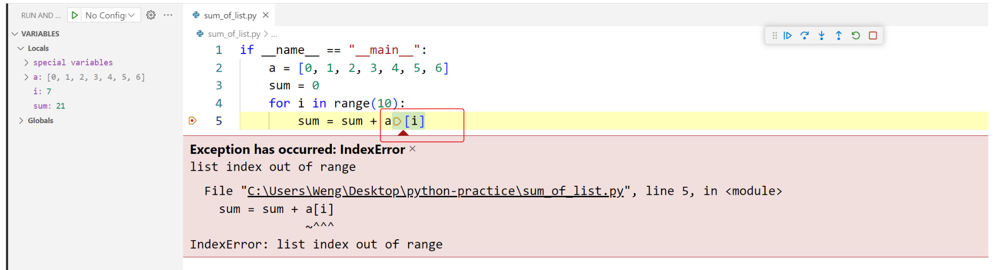

我们发现报错了，这里的错误就是我们一开始在输出结果时看到的错误。直到这里，我们终于能够更加清楚的直到为什么代码会出错了。是由于i = 7，在计算机查询a[7]的值时发生了错误。错误类型为IndexError：list index out of range.如果看不懂这个意思，可以再通过百度或者大模型去询问这个问题应该怎么解决。其实在这里，他就给出了一个解决方案，就是将循环的语句改为：`for i in range(len(a))`


我们根据提示修改代码如下：

```python
if __name__ == "__main__":
    a = [0, 1, 2, 3, 4, 5, 6]
    sum = 0
    for i in range(len(a)):
        sum = sum + a[i]
```

将这个代码复制到VScode上，执行，发现现在代码就没有bug，顺利的执行了这个求和的功能。

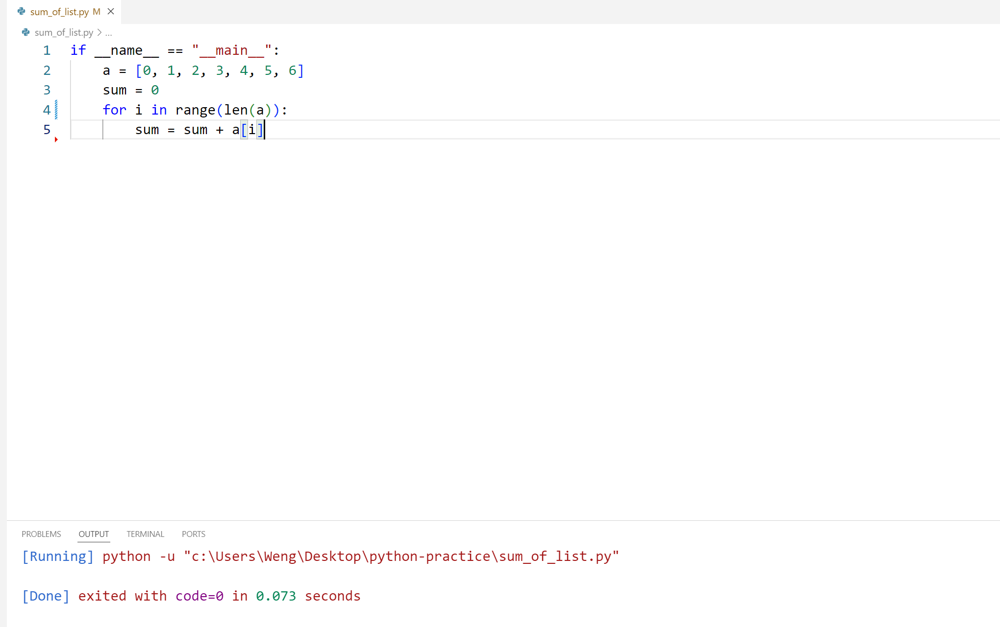

#### step4 Print/log调试(可选调试方法之一)

除了打断点的方法，还有什么方法可以使用呢？我们可能会想，如果我们能让程序自动的运行，并且能够自动记录每个变量的变化就好了。我们就不用一步一步地去调试了。事实上，print/log方式就是这种方式。print方式就是直接将结果输出在输出框中，log文件可以将输出文件输出到一个log日志上。本质上都是查看程序在运行中的一些变量变化，而不影响程序的正常运行。

下面先介绍print方式。比如还是上面那个例子，我们发现第5行发生了报错，我们并且指向i的原因。因此，我们好奇哪个值会导致报错。

```python
if __name__ == "__main__":
    a = [0, 1, 2, 3, 4, 5, 6]
    sum = 0
    for i in range(len(a)):
        print("i:", i)
        sum = sum + a[i]

```

执行代码会输出下面这些结果：

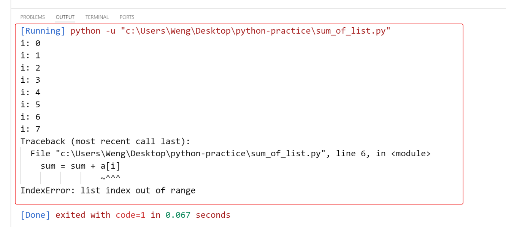

这回我们不用自己一次一次的点击鼠标，我们看到当i=7的时候，出现了这个问题，也是能够告诉我们，实际上就是index大于了数组的长度，使得报错了。

**log方式debug(TODO)**

### 3. 提交代码

至此，我们回顾一下我们完成了什么事？我们把远程的代码拉了下来，经过代码调试，我们终于把代码改好跑通了。但是，这难道就结束了吗？并不是，如果是自己一个人的代码当然没问题，因为代码永远只有自己一个人看。但是假如这个代码是一起协作完成的，该怎么将自己的修改提交到远程的，让别人也能同步你的修改呢？这个时候，就需要用到git了。所以git和gitee（github）三者之间有什么区别呢？我们可以问问大模型。

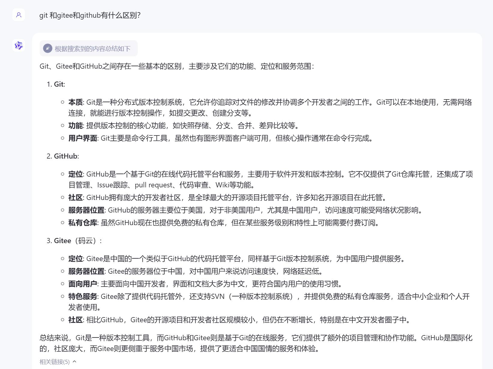

可以先阅读此页面（https://git-scm.com/book/en/v2/Getting-Started-What-is-Git%3F）。特别强调文件可以处于的三种主要状态：已修改(**modified**)、暂存(**staged**)和已提交(**committed**)。

基本的 Git 工作流程是这样的：

1. 你在工作目录中修改文件。
2. 你选择性地将希望包含在下一次提交中的更改添加到暂存区。
3. 你执行提交操作，该操作会将暂存区中的文件记录永久保存到Git仓库中。

Git 是一个强大的工具，值得花一些时间来了解它的基础知识。鼓励阅读以下 3 章：

1. 第2章：https://git-scm.com/book/en/v2/Git-Basics-Getting-a-Git-Repository
2. 第1章：https://git-scm.com/book/en/v2/Getting-Started-About-Version-Control
3. 第3章：https://git-scm.com/book/en/v2/Git-Branching-Branches-in-a-Nutshell

这是很有用的备忘单：https://training.github.com/downloads/github-git-cheat-sheet.pdf

我们可以将分支发布到github上，在github上查看新分支的变化。请注意，如果你尝试推送到我的存储库，它将不起作用；确保你有[fork](https://gitee.com/help/articles/4128#article-header0)编辑你自己的存储库，然后推送它。

我们的远程推送成功了。在这里我们可以看到修复分支中的新提交。

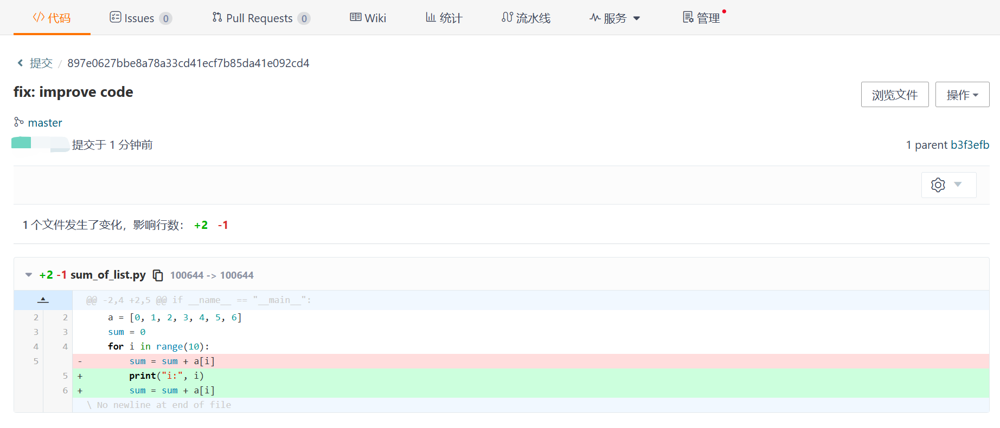

### 4.Codespace(推荐)

一个更快的体验conda环境和vscode环境方法，免去了繁琐的安装步骤。推荐用这种方法快速验证上述流程。

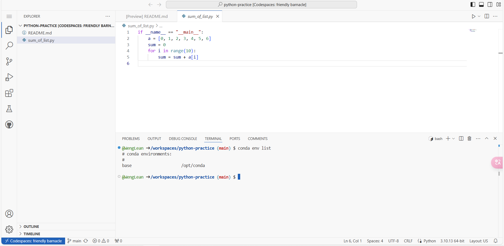

[Create new codespace (github.com)](https://github.com/codespaces/new)