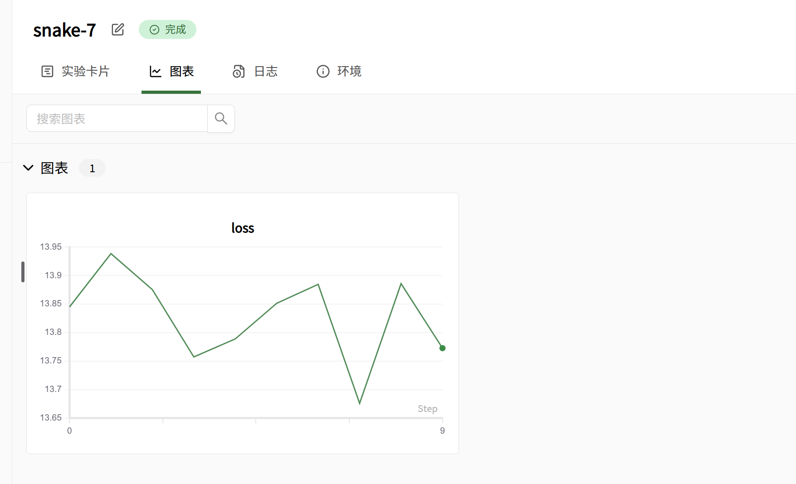
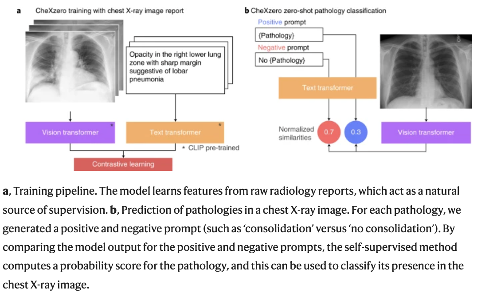
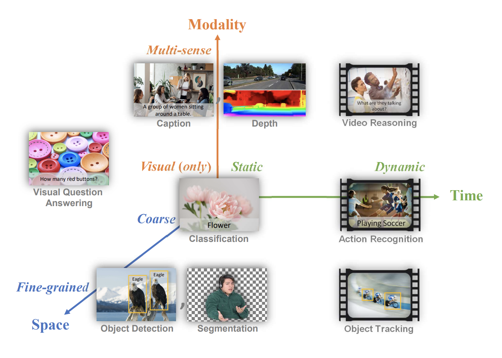
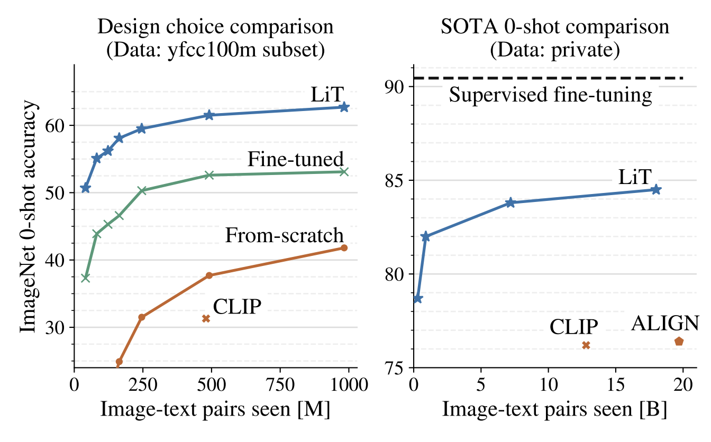
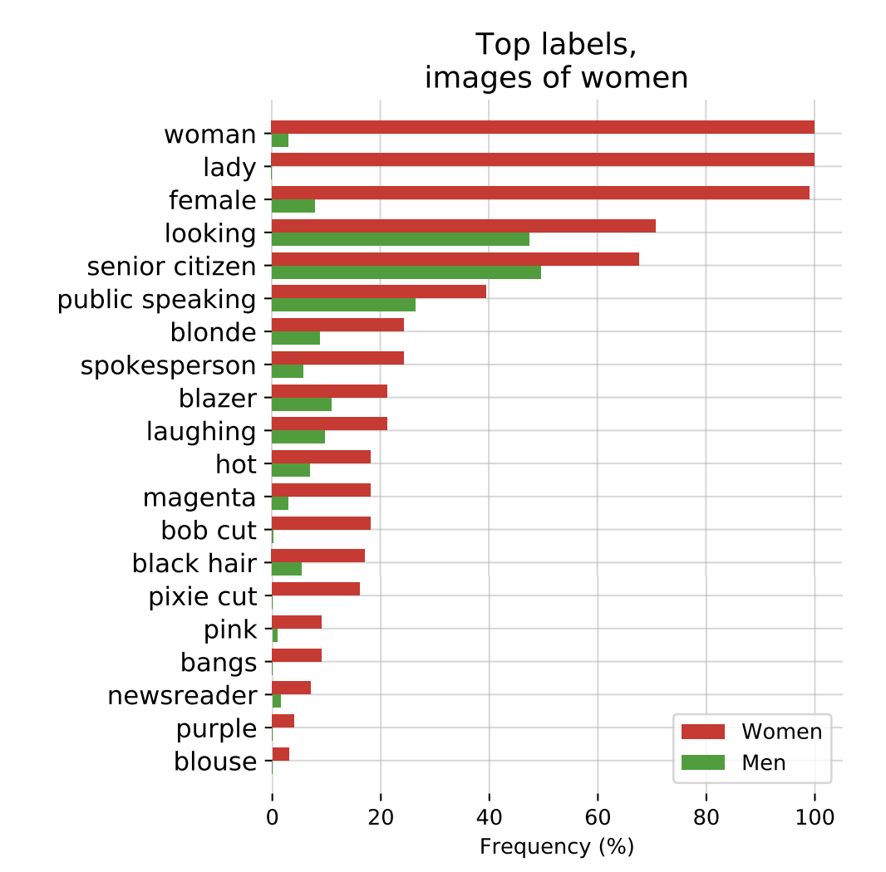

# 6. 如何产生新的研究想法

> 导读: 提出好的研究想法是相当困难的，特别是当你刚接触一个领域时——这需要对文献中的空白有所了解。然而，产生研究想法的过程可以在阅读一篇研究论文之后就可以开始了。
>
> 在这次课程中，我将与你分享一套框架可帮助你生成自己的研究想法。首先，你将学习如何应用一个框架来识别研究论文中的空白(别人没研究过)，包括研究问题、实验设计和发现等方面。接着，你将学习如何应用一个框架来基于一篇研究论文生成想法，思考感兴趣任务的要素、评估策略以及所提方法。最后，你将学习如何应用一个框架来迭代你的想法，以提高它们的质量。
>
> 本次课程的结构是这样的：首先，你需要通过阅读两篇指定的研究论文来做准备，然后我们将运用这些框架到你已阅读的论文上。
## 本教程目标：
1. 能够识别研究论文中的空白，包括研究问题、实验设置和研究发现。
2. 能够基于研究论文产生新想法，考虑感兴趣任务的元素、评估策略和提出的方法。
3. 能够迭代自己的想法以提高其质量。
## 

## 准备工作

在开始这次讲座之前，建议阅读[CheXzero](https://www.nature.com/articles/s41551-022-00936-9)（“通过自监督学习从未标注的胸部X射线图像中检测病理的专家级方法”）和[CLIP](https://arxiv.org/pdf/2103.00020)（“通过自然语言监督学习可转移视觉模型”），以便能够跟上讲座中引用的示例。

参考我们之前的笔记，了解如何阅读研究论文。

## 识别论文中的空白

所有研究论文都存在空白——未被问及的问题、实验设置中的不足以及与先前工作的比较上的差距。这些空白往往指明了未来研究的重要方向。

接下来，我将分享一些识别研究论文中空白的方法，并以CheXzero论文为例进行说明。

### 识别研究问题中的空白

写下论文的核心研究问题，然后写下支持该核心问题的研究假设。研究假设是对“研究者预测研究结果的精确、可测试陈述”，并非所有假设都会明确陈述，你可能需要从所执行的实验中推断。

现在，你可以观察总体研究问题与研究假设之间的空白——哪些假设尚未得到检验？

```markdown
示例答案：
研究问题：算法在无明确标注的情况下能多好地检测疾病？
研究假设：
一个基于胸透报告自我监督训练的模型（CheXzero）可以完成病理分类任务，其准确度可与放射科医师媲美。
CheXzero在病灶检测上能超越完全监督模型。
CheXzero在疾病分类上优于先前的自我监督方法（如MoCo-CXR、MedAug和ConVIRT）。
空白：
CheXzero是否能检测从未在报告中隐含出现过的疾病？
即使使用少量的图文报告语料库，CheXzero是否仍能保持高水平性能？
```

### 识别实验设置中的空白 

现在我们已经确定了研究假设，可以看看实验设置——在这里我们可以关注空白方法的评估方式是否有不足？比较的选择或实施方式是否有缺陷？

最重要的是，实验设置是否能决定性地测试研究假设？我们不看实验结果，而是看实验本身的设置。

```
示例答案：
研究假设（实验设置）：
- 一个在胸部X射线报告上训练的自监督模型（CheXzero）可以以与放射科医生相当的准确性执行病理分类任务。
- 使用单一机构的500项研究的测试集进行评估，参考标准由多数投票确定——类似于先前的研究。比较是在5种疾病上进行，使用3名持证放射科医生的平均值进行F1和MCC指标的比较。

空白：
假设1：放射科医生的数量可能太少，无法决定性地证明与放射科医生完全可比。也许需要了解放射科医生的经验/培训，以更精确地定义什么构成放射科医生级别的表现。
假设2：评估的病理数量受到测试集中样本数量的限制。评估更多的病理类别将更支持这些假设。
假设3：比较的自监督方法数量有限——选择了标签高效的方法ConVIRT、MedAug和MoCo-CXR。可以比较更多的自监督学习算法。
假设3：不清楚比较是单一模型还是集成模型，或者是否使用相同的训练来源。
```

### 通过明确和隐含的限制识别空白

现在我们已经识别了实验设置中的空白，接下来关注结果和讨论。

在这里，我们要寻找明确表达的工作限制。部分工作很容易，因为有时有一个明确的限制部分可以直接使用；或者可以从未来工作的陈述中推断出来。然而，有时方法的限制体现在结果本身，即方法失败的地方。

```markdown
示例答案：
明确列出：
- “自监督方法仍然需要反复查询标记验证集的性能，以进行超参数选择和计算MCC和F1统计数据时确定特定条件的概率阈值。”
- “自监督方法目前仅限于分类图像数据；然而，医学数据集通常结合不同的成像模态，可以从电子健康记录或其他来源整合非成像数据，或者可以是时间序列。例如，磁共振成像和计算机断层扫描生成的三维数据已经被用于训练其他机器学习管道。”
- “同样，有兴趣将该方法应用于其他任务，其中医学数据与某种形式的非结构化文本配对。例如，自监督方法可以利用描述诊断（如癌症）的病理报告，这些报告存在于组织病理学扫描中。”
- “最后，未来的工作应该开发方法，将该方法扩展到更大的图像尺寸，以更好地分类较小的病理。”
通过结果隐含：
- 模型在肺不张和胸腔积液上的MCC表现低于放射科医生。
- 模型在Padchest上的AUC性能在57个放射学发现中的19个发现中< 0.700，其中n>50。
- CheXzero方法在检测Padchest上的“No Finding”方面严重表现不佳，AUC为0.755。
```

## 生成研究想法

我们已经使用框架识别了研究论文中的空白，这些空白为改进提供了机会，但不一定总是清楚如何解决这些空白。

以下框架旨在帮助你思考可以在三条轴线上构建研究论文，我们再次应用此框架到CheXzero示例。

### 改变感兴趣的任务

- 你能否将主要想法应用到不同的模态？
  - 示例：病理幻灯片通常有相关的报告，你能否将病理幻灯片与报告配对并进行疾病检测？
- 你能否将主要想法应用到不同的数据类型？
  - 示例：也许报告不一定是文本——也许我们可以将医学图像（例如病理幻灯片）与可用的基因组改变配对，并执行类似的对比学习。
- 你能否将方法或学习模型应用于不同的任务？
  - 示例：也许CheXzero模型可以用于对象检测或图像语义分割？或者用于医学图像问答。
- 你能否改变感兴趣的结果？
  - 示例：与其关注准确性，我们可以检查CheXzero对比学习方法的鲁棒性特性，或者考虑方法的数据效率或其在不同患者子群上的性能与完全监督的方法相比。

### 改变评估策略

- 你能否在不同的数据集上进行评估？
  - 示例：CheXzero仅考虑了CheXpert、MIMIC-CXR和Padchest。然而，还有其他数据集，包括非常不同类型的患者或疾病检测任务，例如深圳数据集（包括结核病检测）或Ranzcr CLIP（包括管道定位任务）。
- 你能否使用不同的指标进行评估？
  - 示例：AUC指标用于评估判别性能，但它不能给我们提供模型校准的见解（概率输出是否反映了长期疾病结果的比例），这可以通过校准曲线来衡量。
- 你能否理解为什么某些方法效果好/不好？
  - 示例：尚未探讨疾病特定词汇在报告中出现的频率与不同病理上的性能之间是否存在关系。这种关系可以通过实验证实，以解释在某些类别上的高性能和在其他类别上的低性能。
- 你能否进行不同的比较？
  - 示例：我们可以解决许多未解决的比较，包括在Padchest上对放射科医生和模型的比较，这需要收集更多的放射科医生注释。

### 改变提出的方法

（提示：这组问题可能最适用于深度学习方法论文。然而，我在其他研究子领域中也发现了类似的问题集。）

- 你能否改变训练数据集或数据元素？
  - 示例：CheXzero在MIMIC-CXR上训练，这是少数几个同时具有图像和报告的数据集之一。然而，可以更改的是训练可以使用IU-Xray数据集（OpenI）进行增强，或者训练可以使用放射报告的另一部分（发现部分）。
- 你能否改变预训练/训练策略？
  - 示例：CheXzero利用OpenAI模型的预训练权重，但有更新的检查点可用，这些检查点是在更大的数据集（LAION-5B）上训练的。此外，有修改损失函数的训练策略，包括掩码语言模型结合图像-文本对比损失，这些都是未来工作的探索领域。
- 你能否改变深度学习架构？
  - 示例：而不是为图像和文本单独使用一个编码器，可以使用一个多模态编码器；这个编码器可以同时接受图像/图像嵌入和文本/文本嵌入。这个想法来自于视觉语言建模/预训练的进展。
- 你能否改变问题的表述？
  - 示例：目前CheXzero问题的表述仅限于接受一个输入，而通常一份报告可以配对多张胸部X射线图像。可以将表述扩展为接受一个或多个可用的图像（视图）作为输入。

> 练习：使用上述框架识别CLIP(或者你自己领域里的一篇文章)的扩展创意。

## 迭代你的研究创意

你想到的创意在迭代中会变得更好，为什么一个想法可能不是一个好主意？

原因包括：它们可能没有解决实际问题，它们可能已经发表，或者它们可能不可行。那么，如何评估一个想法是否好呢？

### 3.1 搜索你的想法是否已被尝试：

你的新想法可能已经被尝试过，尤其是如果你计划构建的论文不是最新的。我在这里做的一个练习是为你的新论文想法构建标题，看看谷歌是否会显示结果。关键有时是了解多种表达同一概念的方式，这需要理解相关工作。

```
示例：
如果我对将CheXzero类似的方法应用于其他类型的数据感兴趣，我可能会搜索：
- 对比学习组织病理学文本（没有相关结果）
- 对比学习组织病理学基因组改变（返回匹配项）
```

**阅读重要的相关工作和后续工作：**

通常，相关工作或讨论可能明确指出有价值的替代方法：列出这些方法并开始阅读这些方法。你可能会受益于阅读描述你的实验将使用的数据集创建的论文。

如果你构建的论文已经存在很长时间，你可以通过使用Google Scholar的“被引用”搜索、在ArXiv上搜索摘要或明确搜索感兴趣的任务以查看相关基准来找到基于该工作的论文。保持如之前课程中使用的阅读列表。我认为，当你在这个阅读列表中阅读更多论文时，好的想法会开始自我强化。

**示例：**

对于CLIP论文：

- **Google Scholar 被引用**




- **ArXiv 搜索**


- **谷歌具体任务**


### 3.2 从专家那里获得反馈

一旦你以书面形式写下了你的想法，接下来强烈建议从领域专家那里获得反馈。你可以给相关领域的专家写邮件，分享你的想法和计划，并询问他们对你的idea的看法。有时你可能会听到这些专家的回音！

最好的办法就是问自己的导师，相关领域的师兄师姐，或者互联网上的同学，当然要辩证的看待，因为当你深入调研一个领域之后，你要相信你已经是有一定判断能力的。

> 练习：现在拿出你为CLIP提出的最佳创意并在谷歌上搜索，并写下你找到的内容。

### 3.3 具体例子

现在，你已经看到了如何开始识别空白、提出创意并迭代它们，让我们看看人们在过去两年中如何识别CLIP中的空白并发表论文的。

#### 3.3.1 改变感兴趣的任务

| [CheXZero](https://www.nature.com/articles/s41551-022-00936-9)**Expert-level detection of pathologies from unannotated chest X-ray images via self-supervised learning** | CheXZero：通过自监督学习从未标注的胸部X射线图像中检测病理的专家级方法<br />1.我们证明了可以利用从自然图像中学习的CLIP架构的预训练权重，训练一个特定领域的医疗任务的零样本模型。<br />2.与CLIP不同，提出的程序允许我们相对于相同疾病分类的否定版本进行归一化，而不是天真地在疾病之间进行归一化，以从logits中获得概率。 |  |
| ------------------------------------------------------------ | ------------------------------------------------------------ | ---------------- |
| [VideoCLIP](https://arxiv.org/pdf/2109.14084.pdf)**: Contrastive Pre-training for Zero-shot Video-Text Understanding** | **VideoCLIP：视频-文本理解的对比预训练**<br />**1.VideoCLIP通过对比时间上重叠的正视频-文本对与来自最近邻检索的硬负样本，训练一个用于视频和文本的转换器。**<br />**2.我们的努力与[CLIP]的后续工作一致，但这是第一个将预训练的判别模型转移到多模态视频理解中的广泛任务中。** |  |
| [Florence](https://arxiv.org/pdf/2111.11432.pdf)**: A New Foundation Model for Computer Vision** | 尽管现有的视觉基础模型如CLIP（Radford等，2021）……主要关注将图像和文本表示映射到跨模态共享表示，我们引入了一个新的计算机视觉基础模型Florence，以从粗略（场景）到精细（对象）、从静态（图像）到动态（视频）以及从RGB到多模态（字幕深度）扩展表示。<br />我们扩展了Florence预训练模型，以学习精细的（即对象级别的）表示，这是密集预测任务（如对象检测）的基础。为此目标，我们添加了一个适配器动态头部…… |  |
| 轮到你去总结                                                 | **BASIC, LiT, ALBEF, PaLI, CoCa, Flava**                     |                  |

> 练习：阅读你选择的上述论文。分享它如何改变任务。

#### 3.3.2改变评估策略

| [LiT](https://openaccess.thecvf.com/content/CVPR2022/papers/Zhai_LiT_Zero-Shot_Transfer_With_Locked-Image_Text_Tuning_CVPR_2022_paper.pdf)**: Zero-Shot Transfer with Locked-image text Tuning** | LiT：使用锁定图像-文本微调进行零样本迁移<br />我们以两种方式评估结果模型的多语言性，两者的限制在附录J中讨论。首先，我们使用在线翻译服务将ImageNet提示翻译成最常见的语言，并在每种语言中进行零样本分类。其次，我们使用基于维基百科的图文数据集（WIT）进行T→I检索，涵盖100多种语言。 |  |
| ------------------------------------------------------------ | ------------------------------------------------------------ | ---------------- |
| [Evaluating CLIP](https://arxiv.org/pdf/2108.02818.pdf)**: Towards Characterization of Broader Capabilities and Downstream Implications** | **首先，我们发现类的设计方式可以极大地影响模型在部署时的性能，这需要为用户提供有关如何仔细设计类的教育。其次，我们发现CLIP可以更容易地解锁某些利基任务，因为CLIP通常可以在没有任务特定训练数据的情况下表现出令人惊讶的好性能。<br />当我们研究ZS CLIP在“野外”名人识别任务上的表现时，使用CelebA数据集……我们发现模型在100个可能类中的8000张“野外”名人图片上，top-1准确率为59.2％。然而，当我们将类的数量增加到1000名名人时，这一表现下降到43.3％。** |  |
| 轮到你了                                                     | **BASIC ALBEF PaLI CoCa Flava Florence**                     |                  |

> 练习：阅读你选择的上述论文，并分享它如何改变评估。

#### 3.3.3改变提出的方法

示例：

| [ALIGN](https://arxiv.org/pdf/2102.05918.pdf)**(Scaling Up Visual and Vision-Language Representation Learning With Noisy Text Supervision)** | ALIGN（使用噪声文本监督扩展视觉和视觉-语言表示学习）<br />1.我们利用了一个包含超过十亿图像替代文本对的噪声数据集，这些数据集是在没有昂贵的过滤或后处理步骤的情况下从概念性字幕数据集中获得的。<br />2.ALIGN遵循来自原始替代文本数据的图文对的自然分布，而CLIP通过首先从英文维基百科构建高频视觉概念的白名单来收集数据集。 |  |
| ------------------------------------------------------------ | ------------------------------------------------------------ | ---------------- |
| [Florence](https://arxiv.org/pdf/2111.11432.pdf)**: A New Foundation Model for Computer Vision** | **1.Florence：一个新的计算机视觉基础模型<br />也是一个任务差异（因此从上面重复）<br />2.我们的Florence预训练模型使用一个双塔架构：一个12层转换器（Vaswani等，2017）作为语言编码器，类似于CLIP（Radford等，2021），以及一个分层的视觉转换器作为图像编码器。分层视觉转换器是一个修改的Swin转换器（Liu等，2021a），具有卷积嵌入，称为CoSwin转换器。** |  |
| **轮到你了**                                                 | **BASIC, LiT, ALBEF, PaLI, CoCa, Flava**                     |                  |