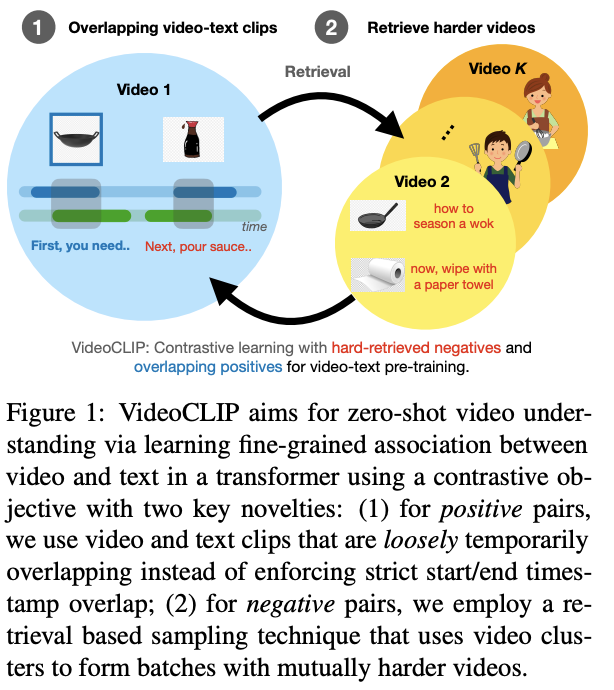
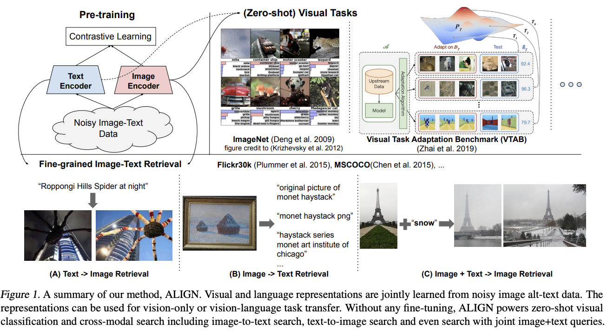

# 7. 如何产生新的研究想法

> 导读: 提出好的研究想法是相当困难的，特别是当你刚接触一个领域时——这需要对文献中的空白有所了解。然而，产生研究想法的过程可以在阅读一篇研究论文之后就可以开始了。
>
> 在这次课程中，我将与你分享一套框架可帮助你生成自己的研究想法。首先你将学习如何应用一个框架来识别研究论文中的空白(别人没研究过)，包括研究问题、实验设计和发现等方面。接着你将学习如何应用一个框架来基于一篇研究论文生成想法，思考感兴趣任务的要素、评估策略以及所提方法。最后你将学习如何应用一个框架来迭代你的想法，以提高它们的质量。
>
> 本次课程的结构是这样的：首先你需要通过阅读两篇指定的研究论文来做准备，然后我们将运用这些框架到你已阅读的论文上。
## 本教程目标：
1. 能够识别研究论文中的空白，包括研究问题、实验设置和研究发现。
2. 能够基于研究论文产生新想法，考虑感兴趣任务的元素、评估策略和提出的方法。
3. 能够迭代自己的想法以提高其质量。

## 准备工作

在开始这次讲座之前，建议阅读[WA](https://arxiv.org/pdf/1911.07053)(在类别增量学习中保持歧视和公平)和[CLIP](https://arxiv.org/pdf/2103.00020)（通过自然语言监督学习可转移视觉模型），以便能够跟上讲座中引用的示例。

参考我们之前的笔记，了解如何阅读研究论文。

识别论文中的空白，所有研究论文都存在空白——未被问及的问题、实验设置中的不足以及与先前工作的比较上的差距，这些空白往往指明了未来研究的重要方向。

接下来，我将分享一些识别研究论文中空白的方法，并以WA论文为例进行说明。

### 1.1 识别研究问题中的空白

写下论文的核心研究问题，然后写下支持该核心问题的研究假设。研究假设是对“研究者预测研究结果的精确、可测试陈述”，并非所有假设都会明确陈述，你可能需要从所执行的实验中推断。

现在，你可以观察总体研究问题与研究假设之间的空白——哪些假设尚未得到检验？

**示例答案：**

```markdown
研究问题：算法在连续训练新数据的情况下能多好地进行图像分类？
研究假设：
1. 知识蒸馏（KD）技术可以帮助模型在旧类别内输出更具区分性的结果，但其对于模型倾向于将对象分类到新类别的问题没有帮助，导致KD的积极效果被隐藏和限制。
2. 在类别增量学习中，最后全连接（FC）层的权重高度偏向新类别，这是导致灾难性遗忘的一个重要因素。
3. 通过权重对齐（Weight Aligning, WA）纠正FC层中的偏差权重，可以在不需要额外参数或预先保留验证集的情况下，有效缓解灾难性遗忘。
空白：
1. 权重对齐（WA）是否能够适应不同数量类别的增量学习场景，并且在不同设置下保持一致的性能提升？
2. 该方法是否能够处理类别极度不平衡的情况，即在新类别样本数量远多于旧类别时仍能保持对旧类别的识别能力？
3. 权重对齐（WA）方法是否能够推广到其他类型的神经网络架构，例如卷积神经网络（CNN）之外的网络？
```

### 1.2 识别实验设置中的空白 

现在我们已经确定了研究假设，可以看看实验设置——在这里我们可以关注空白方法的评估方式是否有不足？比较的选择或实施方式是否有缺陷？最重要的是，实验设置是否能决定性地测试研究假设？我们不看实验结果，而是看实验本身的设置。

**示例答案：**

```
研究假设（实验设置）：
1. 知识蒸馏（KD）和权重对齐（WA）的结合可以在类别增量学习中提高模型对新旧类别的分类性能。
2. 在ImageNet ILSVRC 2012和CIFAR-100数据集上进行的实验可以有效地评估所提出方法的性能。

空白：
假设1：实验中是否考虑了不同领域（如自然语言处理或语音识别）的数据集，以验证所提出方法的领域泛化能力。可能需要在非图像数据集上进行额外的实验，以更全面地评估模型的泛化性能。
假设2：实验主要关注top-1和top-5准确率作为性能指标，可能没有充分考虑其他评价指标（如计算效率、内存占用等）。这些因素对于实际应用来说同样重要，可能需要在未来的研究中进行评估。
假设3：实验设置中没有明确说明是否考虑了不同数量类别的增量学习场景，以及这些场景对模型性能的影响。可能需要在更多类别和更复杂的设置下验证方法的鲁棒性。
```

### 1.3 通过明确和隐含的限制识别空白

现在我们已经识别了实验设置中的空白，接下来关注结果和讨论。

在这里，我们要寻找明确表达的工作限制。部分工作很容易，因为有时有一个明确的限制部分可以直接使用；或者可以从未来工作的陈述中推断出来。然而，有时方法的限制体现在结果本身，即方法失败的地方。

**示例答案**

```markdown
明确列出：
1. “知识蒸馏（KD）技术可以帮助模型在旧类别内输出更具区分性的结果，但不足以解决模型倾向于将对象分类到新类别的问题。”
2. “权重对齐（WA）通过纠正FC层中的偏差权重，显著提高了模型在新旧类别之间的公平性，并显著提高了整体性能。”
3. “结合KD和WA的方法在ImageNet-1000、ImageNet-100和CIFAR-100数据集上的性能超过了现有的最先进方法。”
4. “WA作为一种后处理技术，通过调整新旧类别的权重公平性，有效缓解了模型的预测偏差。”
5. “所提出的方法在处理灾难性遗忘和类别不平衡问题方面具有显著的性能提升。”
通过结果隐含：
1. “尽管知识蒸馏（KD）有助于保持旧类别的区分性，但其在减少旧样本被错误分类到新类别方面的效果有限，这可能表明KD在新旧类别间的平衡上存在不足。”
2. “权重对齐（WA）在提高模型性能方面的效果显著，这暗示了FC层权重的偏差对模型性能有重要影响，且这种偏差可以通过后处理技术得到有效纠正。”
3. “结合KD和WA的方法在不同数据集上的性能提升表明，该方法具有良好的泛化能力，但在更广泛的数据类型和任务上的泛化能力尚未得到验证。”
4. “所提出的方法虽然在实验中表现出色，但论文中也指出了未来研究的必要性，包括在更多类别和更复杂设置下验证方法的鲁棒性，以及在其他领域的数据集上评估模型的泛化能力。”
```

## 生成研究想法

我们已经使用框架识别了研究论文中的空白，这些空白为改进提供了机会，但不一定总是清楚如何解决这些空白。

以下框架旨在帮助你思考可以在三条轴线上构建研究论文，我们再次应用此框架到WA示例。

### 2.1 改变感兴趣的任务

- 你能否将主要想法应用到不同的模态？
  - 示例：对于WA，是否可以将权重对齐的概念应用到不同类型的神经网络层，或者不同的学习任务，如自然语言处理或语音识别中？
- 你能否将主要想法应用到不同的数据类型？
  - 示例：WA主要在图像数据上展示其效果，是否可以将WA应用于结构化数据或时间序列数据的增量学习问题？
- 你能否将方法或学习模型应用于不同的任务？
  - 示例：WA在分类任务中表现出色，是否可以将其应用于回归、聚类或其他机器学习任务？
- 你能否改变感兴趣的结果？
  - 示例：除了准确率，是否可以评估WA在模型的泛化能力、鲁棒性或计算效率方面的表现？

### 2.2 改变评估策略

- 你能否在不同的数据集上进行评估？
  - 示例：WA在ImageNet和CIFAR-100上进行了评估，是否可以在其他图像数据集，如PASCAL VOC或COCO，以及其他领域的数据集上进行评估？
- 你能否使用不同的指标进行评估？
  - 示例：除了top-1和top-5准确率，是否可以使用F1分数、AUC-ROC或其他指标来评估WA的性能？
- 你能否理解为什么某些方法效果好/不好？
  - 示例：是否可以分析WA在不同类别或不同难度的任务上的表现差异，并理解其背后的原因？
- 你能否进行不同的比较？
  - 示例：是否可以与更多最新的增量学习方法进行比较，或者在不同的实验设置下评估WA的性能？

### 2.3 改变提出的方法

（提示：这组问题可能最适用于深度学习方法论文，然而我在其他研究子领域中也发现了类似的问题集。）

- 你能否改变训练数据集或数据元素？
  - 示例：WA在标准数据集上进行了训练，是否可以在更具挑战性的数据集上训练，或者在数据增强、数据不平衡的情况下评估WA？
- 你能否改变预训练/训练策略？
  - 示例：WA在正常训练后进行权重对齐，是否可以在预训练阶段就考虑权重对齐，或者在训练过程中动态调整对齐策略？
- 你能否改变深度学习架构？
  - 示例：而不是为图像和文本单独使用一个编码器，可以使用一个多模态编码器；这个编码器可以同时接受图像/图像嵌入和文本/文本嵌入。这个想法来自于视觉语言建模/预训练的进展。
  - 示例：WA依赖于全连接层的权重调整，是否可以将WA应用于卷积层或其他类型的网络层？
- 你能否改变问题的表述？
  - 示例：WA目前是针对类别增量学习问题，是否可以将其扩展到其他类型的增量学习问题，如属性增量学习或任务增量学习？

**练习**

> 使用上述框架识别图像分类(或者你自己领域里的一篇文章)的扩展创意。

## 迭代你的idea

你想到的idea在迭代中会变得更好，为什么一个想法可能不是一个好主意？**原因包括：它们可能没有解决实际问题，它们可能已经发表，或者它们不可行。**

那么，如何评估一个想法是否好呢？

### 3.1 搜索你的idea是否已被尝试

你的新idea可能已经被尝试过，尤其是如果你计划构建的论文不是最新的。我在这里做的一个练习是为你的新论文想法构建标题，看看谷歌是否会显示结果。关键有时是了解多种表达同一概念的方式，这需要理解相关工作。

**示例**

```
如果我对将WA类似的方法应用于其他类型的数据感兴趣，我可能会搜索：
- “权重对齐在多模态学习中的应用”（查看是否有研究将WA应用于结合图像和文本的任务）
- “权重对齐在卷积神经网络以外的架构”（查找WA是否已被应用于除了全连接层之外的其他网络层，如卷积层）
```

**阅读重要的相关工作和后续工作**，**通常相关工作或讨论可能明确指出有价值的替代方法：列出这些方法并开始阅读这些方法**。你可能会受益于阅读描述你的实验将使用的数据集创建的论文。

如果你构建的论文已经存在很长时间，你可以通过使用**Google Scholar的“被引用”**搜索、在`ArXiv`上搜索摘要或明确搜索感兴趣的任务以查看相关基准来找到基于该工作的论文，保持如之前课程中使用的阅读列表。当你在这个阅读列表中阅读更多论文时，好的idea会开始自我强化。

**示例：**对于CLIP论文

- **Google Scholar 被引用**


- **ArXiv 搜索**


- **谷歌具体任务**


### 3.2 从前辈那里获得反馈

一旦你以书面形式写下了你的想法，接下来强烈建议从领域专家或者前辈那里获得反馈。你可以给相关领域前辈写邮件，分享你的想法和计划，并询问他们对你的idea的看法.

最好的办法就是问自己的导师，相关领域的师兄师姐，或者互联网上的同学，当然要辩证的看待，因为当你深入调研一个领域之后，你要相信你已经是有一定判断能力的。

**练习**

> 现在拿出你为CLIP提出的最佳创意并在谷歌上搜索，并写下你找到的内容。

### 3.3 具体例子

现在，你已经看到了如何开始识别空白、提出创意并迭代它们，让我们看看人们在过去两年中如何识别CLIP中的空白并发表论文的。

#### 3.3.1 改变感兴趣的任务

| **[CheXZero](https://www.nature.com/articles/s41551-022-00936-9)Expert-level detection of pathologies from unannotated chest X-ray images via self-supervised learning** | CheXZero：通过自监督学习从未标注的胸部X射线图像中检测病理的专家级方法<br />1.我们证明了可以利用从自然图像中学习的CLIP架构的预训练权重，训练一个特定领域的医疗任务的零样本模型。<br />2.与CLIP不同，提出的程序允许我们相对于相同疾病分类的否定版本进行归一化，而不是天真地在疾病之间进行归一化，以从logits中获得概率。 |  |
| ------------------------------------------------------------ | ------------------------------------------------------------ | ---------------- |
| [VideoCLIP](https://arxiv.org/pdf/2109.14084.pdf)**: Contrastive Pre-training for Zero-shot Video-Text Understanding** | **VideoCLIP：视频-文本理解的对比预训练**<br />**1.VideoCLIP通过对比时间上重叠的正视频-文本对与来自最近邻检索的硬负样本，训练一个用于视频和文本的转换器。**<br />**2.我们的努力与[CLIP]的后续工作一致，但这是第一个将预训练的判别模型转移到多模态视频理解中的广泛任务中。** |  |
| [Florence](https://arxiv.org/pdf/2111.11432.pdf)**: A New Foundation Model for Computer Vision** | 尽管现有的视觉基础模型如CLIP（Radford等，2021）……主要关注将图像和文本表示映射到跨模态共享表示，我们引入了一个新的计算机视觉基础模型Florence，以从粗略（场景）到精细（对象）、从静态（图像）到动态（视频）以及从RGB到多模态（字幕深度）扩展表示。<br />我们扩展了Florence预训练模型，以学习精细的（即对象级别的）表示，这是密集预测任务（如对象检测）的基础。为此目标，我们添加了一个适配器动态头部…… |  |
| 轮到你去总结                                                 | **BASIC, LiT, ALBEF, PaLI, CoCa, Flava**                     |                  |

**练习**

> 阅读你选择的上述论文，分享它如何改变任务。

#### 3.3.2改变评估策略

| [LiT](https://openaccess.thecvf.com/content/CVPR2022/papers/Zhai_LiT_Zero-Shot_Transfer_With_Locked-Image_Text_Tuning_CVPR_2022_paper.pdf)**: Zero-Shot Transfer with Locked-image text Tuning** | LiT：使用锁定图像-文本微调进行零样本迁移<br />我们以两种方式评估结果模型的多语言性，两者的限制在附录J中讨论。首先，我们使用在线翻译服务将ImageNet提示翻译成最常见的语言，并在每种语言中进行零样本分类。其次，我们使用基于维基百科的图文数据集（WIT）进行T→I检索，涵盖100多种语言。 |  |
| ------------------------------------------------------------ | ------------------------------------------------------------ | ---------------- |
| [Evaluating CLIP](https://arxiv.org/pdf/2108.02818.pdf)**: Towards Characterization of Broader Capabilities and Downstream Implications** | **首先，我们发现类的设计方式可以极大地影响模型在部署时的性能，这需要为用户提供有关如何仔细设计类的教育。其次，我们发现CLIP可以更容易地解锁某些利基任务，因为CLIP通常可以在没有任务特定训练数据的情况下表现出令人惊讶的好性能。<br />当我们研究ZS CLIP在“野外”名人识别任务上的表现时，使用CelebA数据集……我们发现模型在100个可能类中的8000张“野外”名人图片上，top-1准确率为59.2％。然而，当我们将类的数量增加到1000名名人时，这一表现下降到43.3％。** |  |
| 轮到你了                                                     | **BASIC ALBEF PaLI CoCa Flava Florence**                     |                  |

**练习**

> 阅读你选择的上述论文，并分享它如何改变评估。

#### 3.3.3改变提出的方法

**示例：**

| [ALIGN](https://arxiv.org/pdf/2102.05918.pdf)**(Scaling Up Visual and Vision-Language Representation Learning With Noisy Text Supervision)** | ALIGN（使用噪声文本监督扩展视觉和视觉-语言表示学习）<br />1.我们利用了一个包含超过十亿图像替代文本对的噪声数据集，这些数据集是在没有昂贵的过滤或后处理步骤的情况下从概念性字幕数据集中获得的。<br />2.ALIGN遵循来自原始替代文本数据的图文对的自然分布，而CLIP通过首先从英文维基百科构建高频视觉概念的白名单来收集数据集。 |  |
| ------------------------------------------------------------ | ------------------------------------------------------------ | ---------------- |
| [Florence](https://arxiv.org/pdf/2111.11432.pdf)**: A New Foundation Model for Computer Vision** | **1.Florence：一个新的计算机视觉基础模型<br />也是一个任务差异（因此从上面重复）<br />2.我们的Florence预训练模型使用一个双塔架构：一个12层转换器（Vaswani等，2017）作为语言编码器，类似于CLIP（Radford等，2021），以及一个分层的视觉转换器作为图像编码器。分层视觉转换器是一个修改的Swin转换器（Liu等，2021a），具有卷积嵌入，称为CoSwin转换器。** |  |
| 轮到你了                                                     | BASIC, LiT, ALBEF, PaLI, CoCa, Flava                         |                  |

## 以图像分类任务为例

1. 更换特征提取器为transformer

论文原文：https://arxiv.org/pdf/2010.11929

对应的代码：https://github.com/jeonsworld/ViT-pytorch

2. 更换普通训练方式为增量学习的范式

论文原文：https://arxiv.org/pdf/1911.07053

对应的代码：https://github.com/luhaochun/Incremental-Learning-with-Weight-Aligning