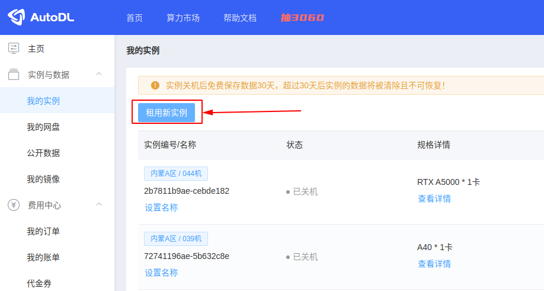
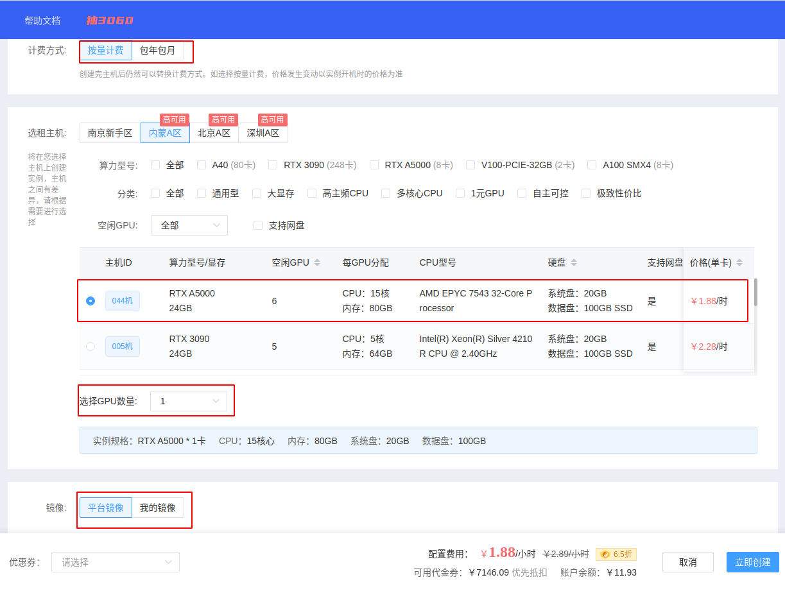
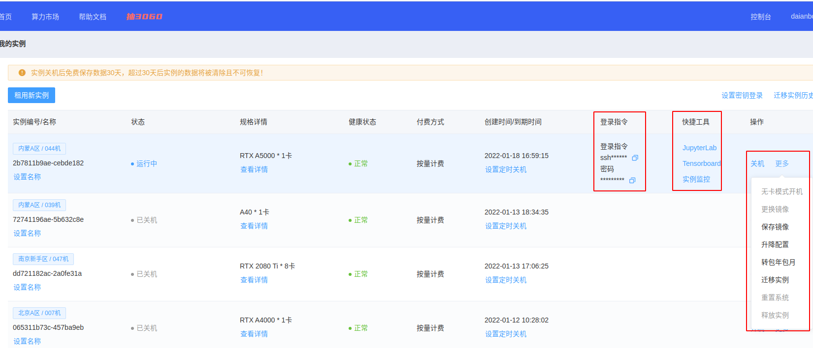
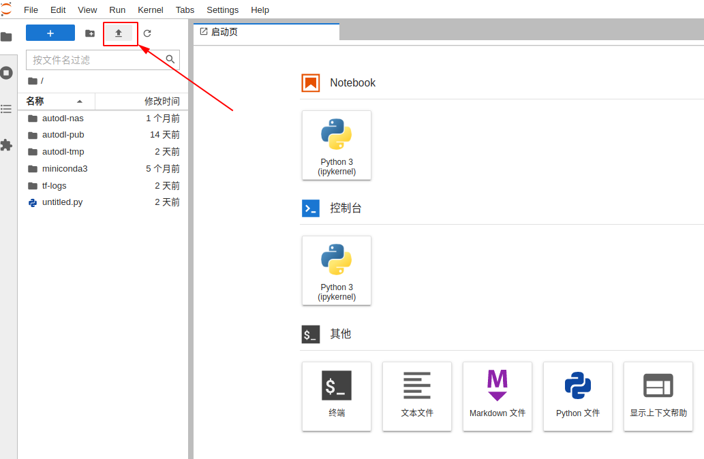
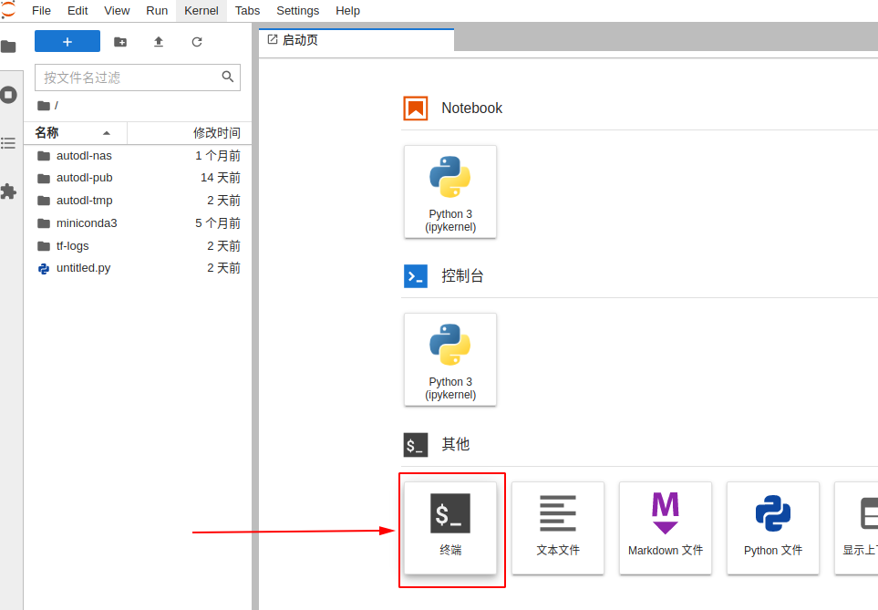
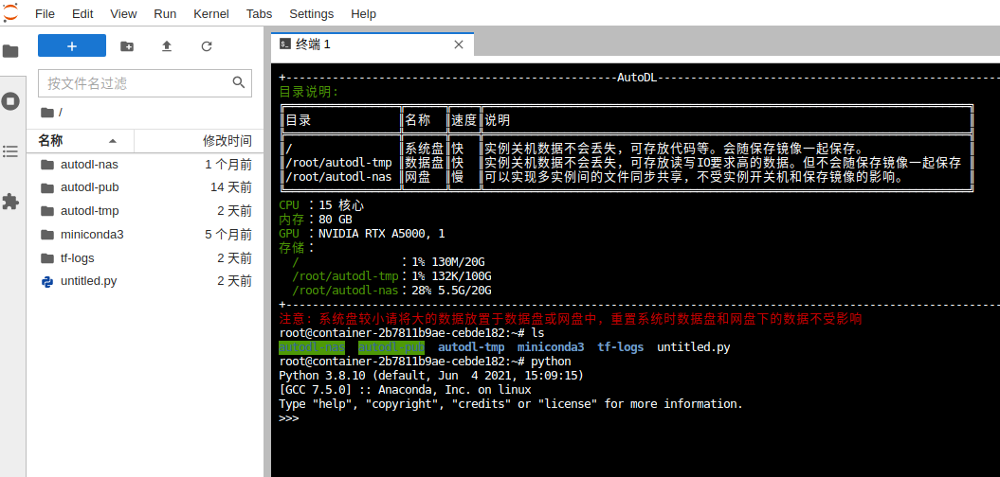

# 云端上的深度学习

> 导读: 当我们开始尝试在本地计算机上开发和训练复杂模型时，这通常不是一个可行的选择。因为我们本地的显存都比较受限制，而且也不是所有同学所在的实验室都有显卡资源。因此，比较推荐的方法是在线上租服务器来训练。
>
> 我们将学习如何利用AutoDL构建解决方案。具体来说，我们将探索和使用容器实例。这些课程将以现场演示/代码演练的形式进行。我们将首先完成 AutoDL 设置，在那里我们将配置并连接到实例。将介绍一些工具，这些工具可以帮助改善开发体验。下一步将是调整现有代码，以便它可以与 GPU 一起使用，从而大大加快计算过程（例如训练模型）。本节将讨论几种进一步加快模型训练速度的方法。最后，我们将对 CheXzero 代码库进行一些实际操作：我们将把代码添加到我们的实例中，并确保我们可以运行模型训练过程。
## 本教程目标
1. 了解如何设置和连接到 AutoDL 容器实例进行深度学习。
2. 学习如何修改深度学习代码以便在 GPU 上使用。
3. 获得使用真实代码库运行模型训练过程的实际操作经验。
## 本教程内容

### AutoDL 快速开始

登录网站，先注册


#### 创建实例

注册后进入控制台，在我的实例菜单下，点击租用新实例



在租用实例页面：选择**计费方式**，选择合适的主机，选择要创建实例中的GPU数量，选择镜像（内置了不同的深度学习框架），最后创建即可。



创建完成后等待开机，今后主要用到的操作入口见截图中



#### 上传数据

开机后在这个正在运行中的实例上找到快捷工具：JupyterLab，点击打开，在下面的截图中找到上传按钮，即可上传数据。



#### 终端训练

在打开的JupyterLab页面中打开终端。



在终端中执行Python命令等完成训练



### 转换为使用 GPU

你可以使用以下命令检查远程实例的主机名以及是否加载了GPU：

```ssh
nvidia-smi
```

这个命令非常有用，因为它可以显示你的GPU是否实际上被利用，这有助于调试机器学习程序。

#### 环境设置

“conda list env”命令列出了实例上可用的所有conda环境。此时，我们将利用我们AMI附带的“pytorch”环境。使用以下命令在终端中激活预装环境：

```
source activate pytorch
```

我们使用“source activate”而不是“conda activate”，因为在实例首次连接时需要初始化conda。因此，以下命令产生相同的效果：

```
conda init
conda activate pytorch
```

#### 代码设置

我们将使用一些可以在此处找到的入门代码。在VS Code终端上将存储库克隆到实例上。

具体来说，我们将处理main.py文件，该文件训练一个模型。我们想比较在不同情况下运行一个epoch所需的时间。因此，第一步是修改代码以包含计时。我们将导入time，使用time.time()函数来监控每个epoch所需的时间，然后打印结果。这将在主函数内的循环中进行。

```python
for epoch in range(1, args.epochs + 1):
    t0 = time.time()
    train(args, model, train_loader, optimizer, epoch)
    t_diff = time.time() - t0
    print(f"Elapsed time is {t_diff}")
    test_loss, test_acc = test(model, test_loader)
    scheduler.step()
```

#### 添加 Wandb 日志记录

正如我们在前几讲中所做的那样，我们还将将Weights and Biases合并到代码库中，以保持良好的实践。conda环境中尚未包含该库，因此我们必须在终端中键入“conda install wandb”来安装它。在main.py中，我们将导入wandb，使用配置中的训练和测试参数初始化wandb，然后记录相关信息。

```python
wandb.init(config={"train_args": train_kwargs, "test_args": test_kwargs})
for epoch in range(1, args.epochs + 1):
    t0 = time.time()
    train(args, model, train_loader, optimizer, epoch)
    t_diff = time.time() - t0
    print(f"Elapsed time is {t_diff}")
    test_loss, test_acc = test(model, test_loader)
    scheduler.step()
    wandb.log({"test_loss": test_loss, "test_acc": test_acc, "time_taken": t_diff}, step=epoch)
```

我们还需要确保在循环结束时添加一个日志记录结束命令。

`wandb.finish()`

一旦添加了这个，我们可以运行带有wandb日志记录的代码。此时，你还可以在代码库的开头添加一个登录语句，或提前使用wandb-CLI进行登录。

#### GPU 调整

如果我们现在运行代码，训练时间会相当慢。在终端中运行nvidia-smi可以帮助我们调查这一点。

尽管我们的实例拥有GPU，但我们仍然没有使用它们。代码本身必须设置为利用GPU。为此，我们将调整main.py文件中的现有入门代码。

旁注：如果我们在没有GPU的实例（如t2.micro实例类型）上运行nvidia-smi命令，它会抛出一个错误。

第一件事是检查CUDA是否可用。在解析器和参数创建并配置后，我们将在主函数中执行此检查。如果cuda可用，需要相应地定义设备，设置工作线程数和shuffle值，并更新训练和测试参数。

```python
use_cuda = torch.cuda.is_available()
if use_cuda:
    device = torch.device("cuda")
    cuda_kwargs = {'num_workers': 1, 'shuffle': True}
    train_kwargs.update(cuda_kwargs)
    test_kwargs.update(cuda_kwargs)
else:
    device = torch.device("cpu")
```

接下来，我们必须将模型和数据（包括训练和测试数据）加载到设备上。这可以通过“.to(device)”函数来完成。我们可以在定义模型时将其移动到设备上。

```python
model = Net().to(device)
```

在处理训练和测试函数的循环时，可以将训练和测试数据移动到设备上。我们还需要更新函数以接收设备作为输入，并在主函数的循环中调用函数时包含设备。

```python
def train(args, model, train_loader, optimizer, epoch, device):
    model.train()
    for batch_idx, (data, target) in enumerate(train_loader):
        data, target = data.to(device), target.to(device)
        ...
def test(model, test_loader, device):
    model.eval()
    test_loss = 0
    correct = 0
    with torch.no_grad():
        for data, target in test_loader:
            data, target = data.to(device), target.to(device)
            ...
def main():
    ...
    for epoch in range(1, args.epochs + 1):
        t0 = time.time()
        train(args, model, train_loader, optimizer, epoch, device)
        t_diff = time.time() - t0
        print(f"Elapsed time is {t_diff}")
        test_loss, test_acc = test(model, test_loader, device)
        scheduler.step()
        wandb.log({"test_loss": test_loss, "test_acc": test_acc, "time_taken": t_diff}, step=epoch)
    ...

```

现在我们使用了GPU，代码运行速度比以前快得多。每个epoch应该大约需要10秒钟来运行。

#### 提高速度

此时，我们应该问自己：如何使其更快？我们将讨论几种可能的想法。

**想法1：更多的GPU**

如果我们使用了所有的GPU容量，那么选择一个具有更多GPU的新实例类型可能是有益的。然而，这里并不是这种情况。

**想法2：增加批处理大小以使用更多的GPU**

也许我们应该尝试将批处理大小从默认的64增加到128。理由是我们只使用了约20%的GPU存储，因此我们可以在每步中使用更多的存储。我们可以通过运行以下命令来尝试这一点：

```python
python main_working.py -batch-size=128
```

事实证明，这种变化可能不会对训练速度产生显著影响（可能对较小/较慢的GPU实例如P2s产生更大影响）。因为这里的模型非常小，瓶颈不在于模型计算，而在于内存瓶颈，这引出了我们的最后一个想法。

##### 想法3：更改工作线程数

早些时候，当我们建立cuda参数时，我们将工作线程数设置为1。我们可以尝试增加这个数量。如果我们将工作线程数设置得过高，如100，可能无法工作。相反，我们应该尝试为此实例推荐的最佳数量，即16。

增加工作线程数的理由是，更多的工作线程将帮助你更快地加载数据，即在GPU完成一个小批次的前向和后向传递后，工作线程已经准备好下一个批次，而不是在上一个批次完全完成后才开始加载数据。我们可以看到，这对数据加载器有影响，因为工作线程数作为参数传递给它。事实证明，这种变化在缩小内存瓶颈和减少训练时间方面是有效的。此外，还可以通过多线程训练过程来优化数据加载。

### 跑一个实际的代码库

现在我们将过渡到处理一个代码库CDLab。我们的目标是让run_train.py文件成功运行。我们可以继续使用之前的实例，但我们将有一个新的环境代码库等。

练习: 将这个代码库，参考这个[具体的教程](HowToRunCDLab.md)，在租的服务器上跑通，训练和测试流程。

