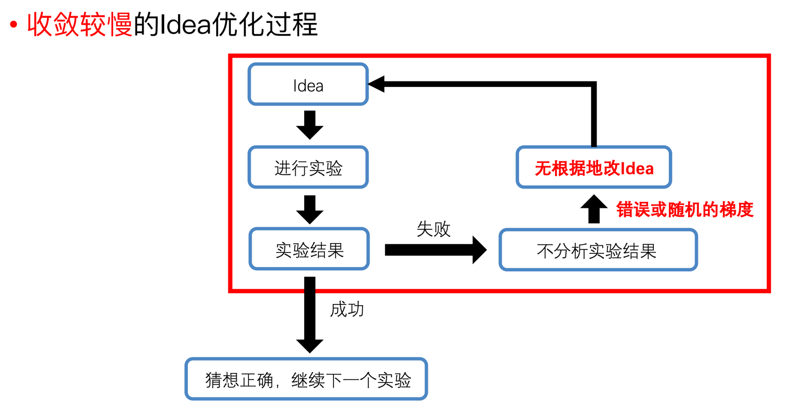

# 9. 万事具备，只欠行动

> **导读**: 当你坚持学习到这一步，并且之前的内容都有跟着操作，那么恭喜你，你已经在脑力层面消化了最难的知识，接下来就是需要你行动的时候了。
>
> 换句话说，接下来就是体力活了，因为路径上要踩的坑你已经趟过一遍了。不要小看这个"体力活"，因为很多人就倒在了执行力不够，导致即使知道方法但不愿意去动手，最终学无所获。
>
> 这一章节可以理解为**衔接"学习研究方法"和"学习论文写作"的桥梁**。
## 本教程目标
1. 遇到所谓的“失败”怎么办？心理建设：不可能事事一帆风顺，出现没有效果的情况太多了。
2. 我尝试的方法没有效果怎么办？
3. 做实验到什么地步就可以开始构思论文了？
## 本教程内容

经过前面的学习，想必大家已经找到了自己的方向，也有了相关领域的实验经验，根据找创新点的教程，想必也做了很多的实验。但是不是每一次实验都能成功，**因此找到实验不work的原因，才能有效地改进当前的方法**。

**分析原因，最重要的步骤就是分析实验结果**。

不分析实验结果的后果：Project做得很慢，很可能不成功，或者被scoop，导致之前投入的时间白费。

如何找到当前实验不work的原因？

1. 搜集当前实验的failure cases（效果不好的实验结果、表面的实验现象）。
2. 搜集当前实验的good cases（效果好的实验结果），或者找到一个能work的实验版本，如何找到能work的实验版本，有两种做法：
   - 把任务变得简单：实验数据的复杂度（比如：大场景 → 小场景，复杂光照 → 简单光照，复杂材质 → 简单材质）、task setting（比如：泛化 → 拟合，稀疏视角 → 稠密视角，RGB监督 → RGB-D监督，降低数据量）
   - 逐个去掉自己加的算法改进
3. 分析“work的实验版本”和“不work的实验版本”之间存在performance gap的技术原因（分析good cases和failure cases之间存在performance gap的技术原因）。

   

   **如果是“work的实验版本”和“不work的实验版本”，要怎么做**

   - 在work的实验上逐步加东西，直到变得不work，从而定位导致实验不work的表面原因，具体做法有两种：

     - **把任务变得复杂**

     - **加算法改进**

   *一次只加一个因素，找到导致不work的因素（该因素越单一越好）*，高水平科研工作者的经验：As you do experiments, **only change one thing at a time**, so you know what the outcome of the experiment means.

   

   - 找到单一的导致不work的因素以后，分析技术原因。列出尽量多的可能性，把这些可能性排个序，具体做法：

      - **可能是代码有bug**，如何检查代码的bug？（这个bug可能是个人对算法的理解不到位，此时需要去看论文或者原理性的东西去理解透彻了再回去检查代码）

        - 逐行检查代码的输出，验证输出的结果和自己的预期是否一样

        - 检查数据的shape

        - 可视化代码输出的结果来验证

        

      -    **可能是算法确实有问题**，算法有问题的四种可能：

         - 超参没设置错误
         - 算法缺了几个tricks
         - 数据不合适
         - 算法本身确实不行。**如何寻找算法的问题，一个有效的方法是看相关的论文为什么可以work，看他们使用了什么tricks。**

         相关论文指的是使用了相近的方法模块/insight、或者解决相近的technical challenge的论文。

         > 💡 有些很牛逼的算法，单独自己的时候不work，需要加一些tricks才work。（比如NeRF + positional encoding）

   **如果是“good cases”和“failure cases”，要怎么做**

   1. 找到good cases和failure cases对应的数据，分析它们的数据特点。是数据上的哪一方面的差异导致了performance gap？

   2. 分析数据差异背后的技术原因是什么？列出尽量多的可能性，把这些可能性排个序，具体做法：

      - 可能是代码有bug
      - 可能是算法确实有问题，算法有问题的四种可能（如上文）：
        - 超参没设置错误
        - 算法缺了几个tricks，导致在这个数据上不work
        - 算法本身确实不行，导致在这个数据上不work
        - 数据太难了，可以换个简单的数据

3. 实验验证上一步中提出的技术原因，一切的猜测最终都要由实验验证，针对导致failure cases的技术原因，提出解法。

   

我觉得**最为重要的一点是，要快速迭代。**

我们做科研，其实并不是每个想法都正确，我们的 idea 总会出错，而且大多数人的大多数idea 都是不 Work 的。我之前有个规律，就是把我的所有结果都写到Google Spreadsheet 里面，然后就发现每当写四五百行或者1000行，就会有一个 Positive 的结果。

所以这就意味着，**产出结果的速度，取决于你迭代的速度，你要迭代的足够快，才有可能快速地出结果**。这是一个很重要的经验，请注意，**快速迭代建立在有效实验的基础上。**盲目地做实验可能让事情变得更糟。

要经常性地确认自己在正确的方向上：当前的算法思路真的对吗？要避免陷入local minima，建议经常找同学交流讨论。

当我们验证的某个创新点在大部分情况下已经有效时，就可以考虑开始构思和撰写论文了。

